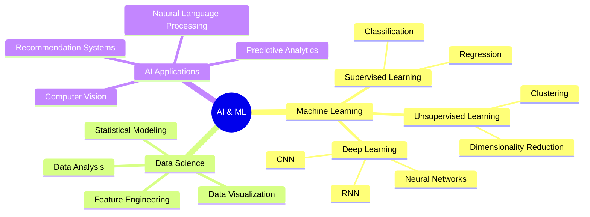

# 👋 Hello, I'm Faizan Mulla!

<div align="center">
  
[](https://git.io/typing-svg)

</div>

## 🚀 About Me

> 🎓 **Diploma in Artificial Intelligence** graduate with a passion for creating intelligent solutions that bridge the gap between cutting-edge AI technology and real-world applications.

I'm a versatile developer who thrives on turning complex problems into elegant, scalable solutions. From building responsive web applications to developing sophisticated machine learning models, I love exploring the endless possibilities where technology meets innovation.

---

## 🛠️ Tech Arsenal

<div align="center">

### 💻 Frontend Technologies


### ⚙️ Backend & Server


### 🗄️ Databases & Big Data


</div>

---

## 🎯 Core Competencies

<table>
<tr>
<td width="50%">

### 🌐 **Web Development**
- 🎨 **Responsive Design**: Creating pixel-perfect, mobile-first interfaces
- ⚡ **Performance Optimization**: Lightning-fast loading times
- 🔧 **Interactive UX**: Engaging user experiences with smooth animations
- 📱 **Cross-Platform**: Web, mobile, and desktop applications

</td>
<td width="50%">

### 🔗 **API Development**
- 🏗️ **RESTful APIs**: Scalable and maintainable backend services
- 📊 **Data Integration**: Seamless database connectivity
- 🔒 **Security**: Authentication, authorization, and data protection
- 📈 **Performance**: Optimized queries and caching strategies

</td>
</tr>
</table>

---

## 🤖 AI & Machine Learning Expertise

<div align="center">

### 🧠 **Artificial Intelligence Skills**



</div>

### 🎯 **AI/ML Project Highlights**

<details>
<summary>🩺 <strong>Breast Cancer Classification Model</strong></summary>

- **🎯 Objective**: Binary classification of breast tumors (Benign vs Malignant)
- **📊 Dataset**: Wisconsin Breast Cancer Dataset (569 samples, 16 features)
- **🤖 Algorithm**: Logistic Regression with feature standardization
- **🏆 Performance**: 97% accuracy, 99% recall, 97% precision
- **🔧 Tech Stack**: Python, Scikit-learn, Pandas, Matplotlib, Seaborn
- **💡 Impact**: Potential clinical decision support tool for early cancer detection

</details>

---

## 🏆 Featured Projects

<div align="center">

| Project | Description | Tech Stack | Live Demo |
|---------|-------------|------------|-----------|
| 🩺 **AI Health Classifier** | Machine learning model for medical diagnosis | Python, Scikit-learn, Pandas | [🔗 Demo](https://your-demo-link.com) |
| 🌐 **Responsive Web App** | Full-stack web application with modern UI | React, Node.js, MongoDB | [🔗 Demo](https://your-demo-link.com) |
| 📱 **Mobile Flutter App** | Cross-platform mobile application | Flutter, Dart, Firebase | [🔗 Demo](https://your-demo-link.com) |
| 🔗 **API Gateway** | RESTful API with microservices architecture | Node.js, Express, MongoDB | [🔗 Docs](https://your-api-docs.com) |

</div>

---

## 🎓 Education & Certifications

<div align="center">

### 🏫 **Academic Background**
```
🎓 Diploma in Artificial Intelligence
   ├── 🧠 Machine Learning Fundamentals
   ├── 📊 Data Science & Analytics
   ├── 🤖 Deep Learning & Neural Networks
   ├── 💻 Programming & Software Development
   └── 🚀 AI Project Implementation
```

</div>

---

## 🌟 What Makes Me Unique

<table>
<tr>
<td width="33%">

### 🎯 **Problem Solver**
I approach every challenge with analytical thinking and creative solutions, whether it's debugging complex code or designing AI algorithms.

</td>
<td width="33%">

### 🚀 **Innovation Driven**
Always exploring cutting-edge technologies and methodologies to stay ahead of industry trends and deliver exceptional results.

</td>
<td width="33%">

### 🤝 **Collaborative Spirit**
I thrive in team environments, believing that the best solutions emerge from diverse perspectives and shared knowledge.

</td>
</tr>
</table>

---

## 📈 Current Focus

```python
class CurrentGoals:
    def __init__(self):
        self.learning = [
            "Advanced Deep Learning Architectures",
            "Cloud Computing (AWS/GCP)",
            "DevOps & CI/CD Pipelines",
            "Advanced React Patterns"
        ]
        
        self.building = [
            "AI-powered Web Applications",
            "Scalable API Architectures",
            "Mobile-first Responsive Designs",
            "Data-driven Solutions"
        ]
        
        self.contributing = [
            "Open Source Projects",
            "AI/ML Community",
            "Technical Blog Writing",
            "Mentoring Junior Developers"
        ]
```


---

<div align="center">

### 💭 *"Code is poetry, AI is magic, and great software is the symphony that brings them together."*

⭐ **Star my repositories if you find them helpful!**

</div>

---

<details>
<summary>🎉 <strong>Fun Fact</strong></summary>

When I'm not coding or training AI models, you might find me exploring the latest tech trends, contributing to open-source projects, or experimenting with new frameworks. I believe that the best way to master technology is to never stop learning and building!

</details>
